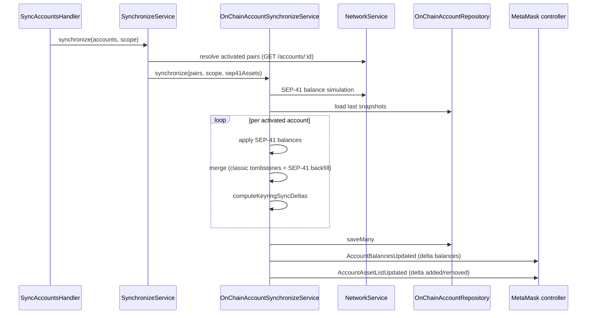

# Synchronization: accounts

On-chain account snapshots (balances, trustlines, SEP-41 tokens) for **activated** keyring accounts.

|                  |                                                                                                               |
| ---------------- | ------------------------------------------------------------------------------------------------------------- |
| **Service**      | `[OnChainAccountSynchronizeService](../../../src/services/on-chain-account/OnChainAccountSynchronizeService.ts)` |
| **Orchestrator** | `[SynchronizeService](../../../src/services/sync/SynchronizeService.ts)`                                         |
| **Snap state**   | `[OnChainAccountRepository](../../../src/services/on-chain-account/OnChainAccountRepository.ts)`                 |
| **Overview**     | [synchronization.md](./synchronization.md)                                                                                  |

## Participants

| Component                          | Path                        | Role                                                                                                                              |
| ---------------------------------- | --------------------------- | --------------------------------------------------------------------------------------------------------------------------------- |
| `SynchronizeService`               | `services/sync`             | Load activated pairs + SEP-41 catalog; run account + tx sync                                                                      |
| `OnChainAccountSynchronizeService` | `services/on-chain-account` | Merge snapshots, persist, emit                                                                                                    |
| `OnChainAccountService`            | `services/on-chain-account` | Resolve live on-chain account                                                                                                     |
| `NetworkService`                   | `services/network`          | [Horizon](https://developers.stellar.org/docs/data/apis/horizon/api-reference/retrieve-an-account) account + SEP-41 balance reads |
| `SyncAccountsHandler`              | `handlers/cronjob`          | Cron / scheduled entry                                                                                                            |

## Request / response

Triggered via `SynchronizeService.synchronize` (see [syncAccounts.md](../../use-cases/cron-job/syncAccounts.md)). Emits keyring events after snap state is persisted:

- `AccountBalancesUpdated`
- `AccountAssetListUpdated`

SEP-41 token balances are **not** from Horizon — they use Soroban RPC `balance(Address)` simulation.

## Step-by-step

1. `SynchronizeService` loads **activated** account pairs from [Horizon](https://developers.stellar.org/docs/data/apis/horizon/api-reference/retrieve-an-account); unfunded / not-yet-activated accounts are skipped.
2. Load SEP-41 asset metadata for the scope (shared with transaction sync on the same run).
3. `OnChainAccountSynchronizeService.synchronize` — batch-fetch SEP-41 token balances (best effort).
4. Load previous snap-state snapshots as merge baseline.
5. Per activated account — apply SEP-41 balances, then **merge** persisted gaps (classic tombstones + SEP-41 backfill).
6. **Compute deltas** — `#computeKeyringSyncDeltas` compares pre-sync snapshot vs merged on-chain view (visibility transitions → balance / asset-list payloads).
7. Persist snapshots atomically, then emit `AccountBalancesUpdated` and `AccountAssetListUpdated`.

Account sync and transaction sync run **in parallel** when both are enabled on the same `synchronize` call.

## Tombstones, merge, and deltas

Merge and deltas are two linked steps:

1. `#mergePersistedEntriesIntoOnChainAccount` — fill gaps so the in-memory on-chain view is complete before diffing.
2. `#computeKeyringSyncDeltas` — compare **persisted snapshot** vs **merged on-chain view** for visibility transitions:
  - newly visible → `added` (+ balance)
  - no longer visible → `removed` (+ balance `0`)
  - already not visible → omit (avoid flooding zeros)

## Sequence

## Data source

| Data                                 | Source                                                                                                                                               |
| ------------------------------------ | ---------------------------------------------------------------------------------------------------------------------------------------------------- |
| Native + classic trustline balances  | **Live on-chain** via [Horizon](https://developers.stellar.org/docs/data/apis/horizon/api-reference/retrieve-an-account) `GET /accounts/:account_id` |
| SEP-41 token balances                | **Live on-chain** (Soroban simulation)                                                                                                               |
| Persisted snapshot                   | **Snap state** (`OnChainAccountRepository`)                                                                                                          |
| Keyring-facing balances / asset list | Emitted from latest snapshot (can be slightly stale until next sync)                                                                                 |

## Related

- [Horizon — Accounts](https://developers.stellar.org/docs/data/apis/horizon/api-reference/resources/accounts)
- [Horizon — Retrieve an Account](https://developers.stellar.org/docs/data/apis/horizon/api-reference/retrieve-an-account)
- [syncAccounts.md](../../use-cases/cron-job/syncAccounts.md) — cron entry and params
- [keyring.md](../../use-cases/keyring/keyring.md) — `listAccountAssets` / `getAccountBalances` read snap snapshots
- [transaction.md](./transaction.md) — transaction sync on the same run

