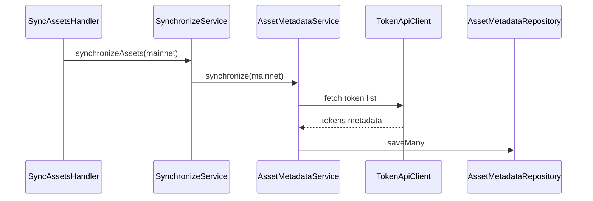

# Synchronization: assets

Asset metadata catalog refresh from the token API.

|                  |                                                                                                    |
| ---------------- | -------------------------------------------------------------------------------------------------- |
| **Service**      | [`AssetMetadataService.synchronize`](../../../src/services/asset-metadata/AssetMetadataService.ts) |
| **Orchestrator** | [`SynchronizeService.synchronizeAssets`](../../../src/services/sync/SynchronizeService.ts)         |
| **Snap state**   | [`AssetMetadataRepository`](../../../src/services/asset-metadata/AssetMetadataRepository.ts)       |
| **Overview**     | [synchronization.md](./synchronization.md)                                                         |

## Participants

| Component              | Path                                | Role                                |
| ---------------------- | ----------------------------------- | ----------------------------------- |
| `SyncAssetsHandler`    | `handlers/cronjob`                  | Cron entry                          |
| `SynchronizeService`   | `services/sync`                     | `synchronizeAssets(scope)` delegate |
| `AssetMetadataService` | `services/asset-metadata`           | Fetch + persist catalog             |
| `TokenApiClient`       | `services/asset-metadata/token-api` | Token API                           |

## Request / response

Triggered by the `synchronizeAssets` cron (see [syncAssets.md](../../use-cases/cron-job/syncAssets.md)). Always uses **mainnet** scope — asset metadata is only available there, regardless of the user's selected network.

Wire format: [SIP-29 Snap Assets API](https://metamask.github.io/SIPs/SIPS/sip-29) (lookup handlers read from the persisted catalog).

## Step-by-step

1. `SyncAssetsHandler` cron fires (always **mainnet** scope).
2. `SynchronizeService.synchronizeAssets(scope)` delegates to `AssetMetadataService.synchronize`.
3. Fetch full token list from the token API.
4. Persist catalog via `AssetMetadataRepository.saveMany`.
5. Failures are logged / tracked; the cron does not fail the whole Snap lifecycle.

During account / transaction sync, `SynchronizeService` also preloads SEP-41 metadata via `fetchSep41AssetsOrSyncOnce` so transaction mapping and balance reads have catalog data without waiting for the assets cron.

## Sequence

## Data source

| Data                                      | Source                                           |
| ----------------------------------------- | ------------------------------------------------ |
| Asset catalog (symbol, decimals, icon, …) | **Token API** → persisted in **snap state**      |
| On-demand lookup (`onAssetsLookup`)       | Snap state catalog (fetch + persist missing ids) |

## Related

- [syncAssets.md](../../use-cases/cron-job/syncAssets.md) — cron entry
- [assets.md](../../use-cases/assets/assets.md) — `onAssets*` handlers
- [transaction.md](./transaction.md) — SEP-41 metadata used during tx mapping
