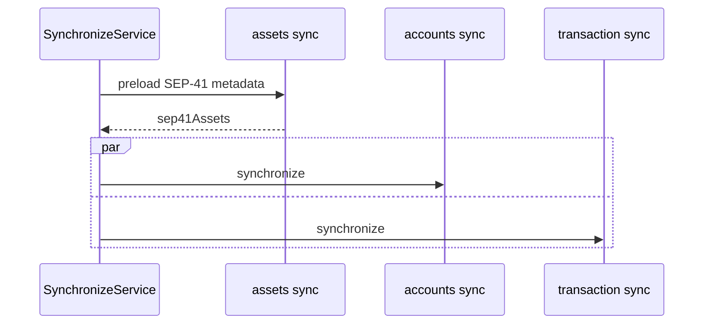
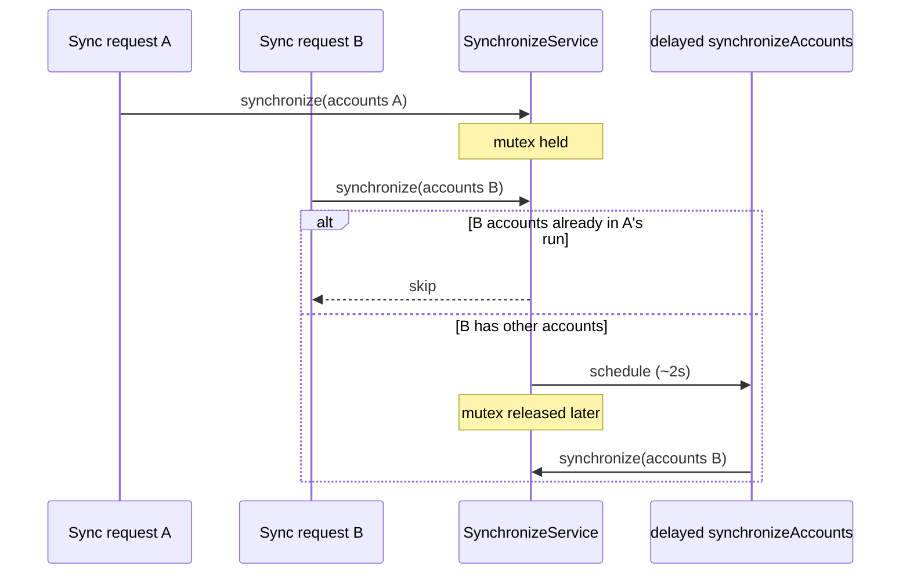

# Synchronization

How background sync wires accounts, transactions, and asset catalog together.

| | |
| --- | --- |
| **Orchestrator** | [`SynchronizeService`](../../../src/services/sync/SynchronizeService.ts) |
| **Accounts** | [accounts.md](./accounts.md) — on-chain snapshots (balances, trustlines, SEP-41) |
| **Transactions** | [transaction.md](./transaction.md) — Horizon history, mapping, pending reconcile |
| **Assets** | [assets.md](./assets.md) — token metadata catalog |

## Participants

| Component | Path | Role |
| --- | --- | --- |
| `CronjobHandler` | `handlers/cronjob` | Gate — skip if inactive / locked |
| `SyncAccountsHandler` | `handlers/cronjob` | Cron / scheduled entry for accounts + txs |
| `SyncAssetsHandler` | `handlers/cronjob` | Cron entry for asset catalog |
| `TrackTransactionHandler` | `handlers/cronjob` | Poll until terminal → then synchronize |
| `SynchronizeService` | `services/sync` | Hub — mutex, parallel account + tx sync, asset catalog |

## Step-by-step

### `synchronizeAccounts` run

1. Load **activated** account pairs (skip unfunded).
2. Preload SEP-41 metadata for the scope.
3. Run **[accounts](./accounts.md)** and **[transactions](./transaction.md)** sync **in parallel**.
4. Per-task failures are logged; they do not fail the whole run.

## Sequence

Component detail: [accounts](./accounts.md) · [transactions](./transaction.md) · [assets](./assets.md)

## Skip synchronization / delay synchronization
`SynchronizeService` uses a mutex so only **one exclusive sync** runs at a time:

| Overlapping request | Behavior |
| --- | --- |
| Same accounts already in the current run | **Skip** (common during onboarding) |
| Other accounts (e.g. after account switch) | **Delay** — schedule `synchronizeAccounts` background event (~2s) instead of waiting on the mutex |

This avoids Snap request timeouts when syncs overlap.

## Related

| Use case | Doc |
| --- | --- |
| Cron gate | [cronjob.md](../../use-cases/cron-job/cronjob.md) |
| Sync accounts entry | [syncAccounts.md](../../use-cases/cron-job/syncAccounts.md) |
| Sync assets entry | [syncAssets.md](../../use-cases/cron-job/syncAssets.md) |
| Track submitted tx | [trackTransaction.md](../../use-cases/cron-job/trackTransaction.md) |
