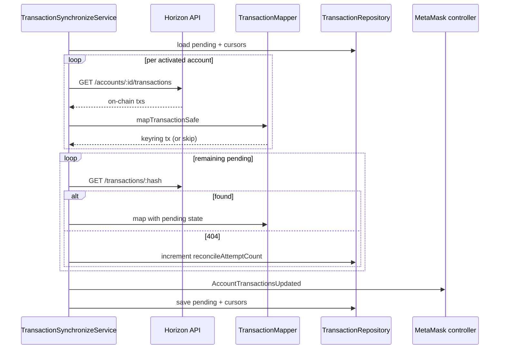

# Synchronization: transactions

Maps [Horizon](https://developers.stellar.org/docs/data/apis/horizon/api-reference/resources/transactions) history to keyring transactions and reconciles snap-state pending txs.

|                |                                                                                                       |
| -------------- | ----------------------------------------------------------------------------------------------------- |
| **Service**    | [`TransactionSynchronizeService`](../../../src/services/transaction/TransactionSynchronizeService.ts) |
| **Mapper**     | [`TransactionMapper`](../../../src/services/transaction/TransactionMapper.ts)                         |
| **Snap state** | [`TransactionRepository`](../../../src/services/transaction/TransactionRepository.ts)                 |
| **Overview**   | [synchronization.md](./synchronization.md)                                                            |

## Participants

| Component                       | Path                   | Role                                                                                                                          |
| ------------------------------- | ---------------------- | ----------------------------------------------------------------------------------------------------------------------------- |
| `TransactionSynchronizeService` | `services/transaction` | Scan, map, reconcile, emit                                                                                                    |
| `TransactionMapper`             | `services/transaction` | On-chain tx → keyring tx                                                                                                      |
| `KeyringTransactionBuilder`     | `services/transaction` | Build keyring tx shapes                                                                                                       |
| `TransactionRepository`         | `services/transaction` | Pending txs + scan cursors                                                                                                    |
| `NetworkService`                | `services/network`     | [Horizon](https://developers.stellar.org/docs/data/apis/horizon/api-reference/resources/transactions) fetch by account / hash |

## Step-by-step

1. **Create context** — load pending txs from snap state, last-scan cursors, all snap-managed accounts on scope (for SEP-41 receive), SEP-41 metadata map.
2. **Scan** — paginated [account transactions](https://developers.stellar.org/docs/data/apis/horizon/api-reference/get-transactions-by-account-id) per **activated** account; map each tx; apply SEP-41 synthetic receive when eligible.
3. **Reconcile pending** — for remaining pending hashes, [fetch by hash](https://developers.stellar.org/docs/data/apis/horizon/api-reference/retrieve-a-transaction); map when found; increment reconcile attempt on 404.
4. **Save & emit** — emit `AccountTransactionsUpdated`, then persist mapped txs + remaining pending + updated cursors.

First scan for an account uses **DESC** (newest first). Incremental scans use **ASC** from the saved cursor.

## Sequence

## Transaction mapping

### How we decide what type of activity it is

| Activity type        | When we map it as this                                                                                                         | Extra mapping conditions                                                                                                                                                                                                                            |
| -------------------- | ------------------------------------------------------------------------------------------------------------------------------ | --------------------------------------------------------------------------------------------------------------------------------------------------------------------------------------------------------------------------------------------------- |
| Send                 | I am the sender, and the transaction only contains payment or create-account operations.                                       | Send takes priority over swap. If there are multiple operations, we only show the first payment or create-account (recipient, asset, amount).                                                                                                       |
| Token send (SEP-41)  | I am the sender, and it is a supported SEP-41 token we recognize.                                                              | Unsupported tokens may fall back to unknown.                                                                                                                                                                                                        |
| Swap                 | I am the sender, the transaction matches our swap pattern, and it includes a path payment that credits back to my own account. | Self-swap is not a receive. If there are multiple path payment operations, we only use the first one for from/to assets and amounts.                                                                                                                |
| Receive              | At least one operation credits my account (payment, account creation, or swap).                                                | Self-send / self-swap are not receives. Failed receives are hidden. Dust spam is hidden (very small incoming native XLM <= 0.001 from someone else). If multiple assets are credited, we show the first unique asset only (amounts are not summed). |
| Token trust (add)    | I am the sender, and every operation is adding trust for a token.                                                              | If there are multiple change-trust operations, we only show the first token.                                                                                                                                                                        |
| Token trust (remove) | I am the sender, and every operation is removing trust for a token.                                                            | If there are multiple change-trust operations, we only show the first token.                                                                                                                                                                        |
| Unknown              | The transaction does not match any rule above, or mapping fails.                                                               | We still show it as activity rather than hiding it.                                                                                                                                                                                                 |

Notes:
General rule for multi-operation transactions:

one on-chain transaction = one history entry.

We do not split multiple sends, swaps, or receives in the same transaction into separate rows.

### Fee handling (Only for transactions that made from MetaMask)

| Activity type              | Fee while pending                          | When settled (confirmed / failed)                                               |
| -------------------------- | ------------------------------------------ | ------------------------------------------------------------------------------- |
| Send                       | No fee shown yet.                          | We read the actual network fee from the settled transaction and show it in XLM. |
| Token trust (add / remove) | No fee shown yet.                          | Same as send - actual network fee in XLM is shown after settlement.             |
| Swap                       | Estimated fee from the signed transaction. | Fee is replaced with the actual network fee from the settled transaction.       |
| Bridge send                | Estimated fee from the signed transaction. | Fee is replaced with the actual network fee from the settled transaction.       |

### Swap amounts (Only for transactions that made from MetaMask)

| Activity type           | Amounts while pending                                                              | When settled (confirmed / failed)                                                                           |
| ----------------------- | ---------------------------------------------------------------------------------- | ----------------------------------------------------------------------------------------------------------- |
| Swap                    | Estimated amounts from the signed transaction, not the final executed amounts yet. | We re-read actual executed amounts from the on-chain result and update the from and to legs.                |
| Contract-based swap     | Amounts shown as `0` - final amounts not known yet.                                | We try to re-map from on-chain data. If that fails, we keep the pending amounts (still `0`) as best effort. |
| Cross-chain bridge send | No from/to amounts in the snap.                                                    | Handled from transaction history when available.                                                            |

## Related

- [Horizon — Transactions](https://developers.stellar.org/docs/data/apis/horizon/api-reference/resources/transactions)
- [Horizon — Account's Transactions](https://developers.stellar.org/docs/data/apis/horizon/api-reference/get-transactions-by-account-id)
- [Horizon — Retrieve a Transaction](https://developers.stellar.org/docs/data/apis/horizon/api-reference/retrieve-a-transaction)
- [Horizon — Pagination](https://developers.stellar.org/docs/data/apis/horizon/api-reference/structure/pagination/page-arguments)
- [syncAccounts.md](../../use-cases/cron-job/syncAccounts.md) — cron entry
- [trackTransaction.md](../../use-cases/cron-job/trackTransaction.md) — post-submit poll
- [keyring.md](../../use-cases/keyring/keyring.md) — `listAccountTransactions` = snap pending only
