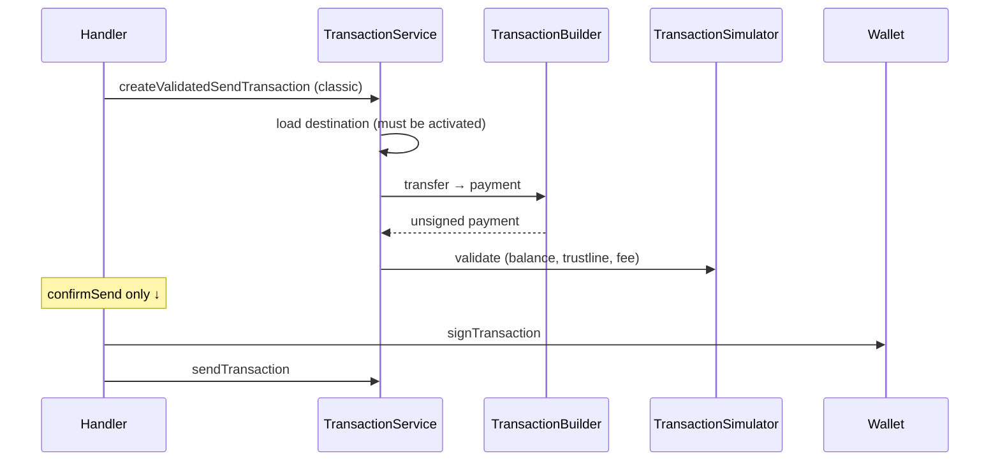

# Send classic trustline asset

Payment of a **classic issued asset** (CAIP-19 classic, non-native). Destination must already hold / be able to receive the asset — the Snap does **not** create the destination account for non-native assets.

| | |
| --- | --- |
| **Service** | `TransactionService.createValidatedSendTransaction` → `#createValidatedClassicAssetTransfer` |
| **Builder** | `TransactionBuilder.transfer` → `#send` (`Operation.payment`) |
| **Client** | [`onAmountInput`](../../use-cases/client-request/onAmountInput.md), [`confirmSend`](../../use-cases/client-request/confirmSend.md) |
| **Submit** | [Submit & bad-sequence retry](./submit-sequence-retry.md) |

## Build

1. Load destination account from the network.
2. If destination is **not** activated → `AccountNotActivatedException` (classic non-native cannot use `createAccount`).
3. Fetch base inclusion fee.
4. `TransactionBuilder.transfer` with `isActivated: true`:
   - Normalize amount to human-readable Stellar units (`normalizeAmount`).
   - `#send` → single `Operation.payment` with `caip19ToStellarAsset(assetId)`.
5. Source sequence / account id from `OnChainAccount`.

Trustline existence / limits on sender and receiver are enforced in **validate**, not by adding a `changeTrust` op on this path (opt-in/out is [`changeTrustOpt`](../../use-cases/client-request/changeTrustOpt.md)).

### Cache

**Send / submit (`confirmSend`) does not use cache** (`useCache: false`). Destination load is always fresh so the envelope is safe to sign.

**Preflight only (`onAmountInput`)** passes `useCache: true` when building the validated send for amount checks. See [onAmountInput cache note](../../use-cases/client-request/onAmountInput.md#note-cache-usage).

## Validate

Local checks against the sender (and destination when known):

- Sender has enough of the classic asset to send.
- Sender and destination trustlines allow the transfer (limit / authorization).
- Sender can cover the network fee in XLM.

## Send

1. `Wallet.signTransaction`.
2. `TransactionService.sendTransaction` — classic envelopes **can** use one automatic `txBadSeq` rebuild + re-sign when the tx source is this wallet account. See [submit-sequence-retry](./submit-sequence-retry.md).

## Flow

