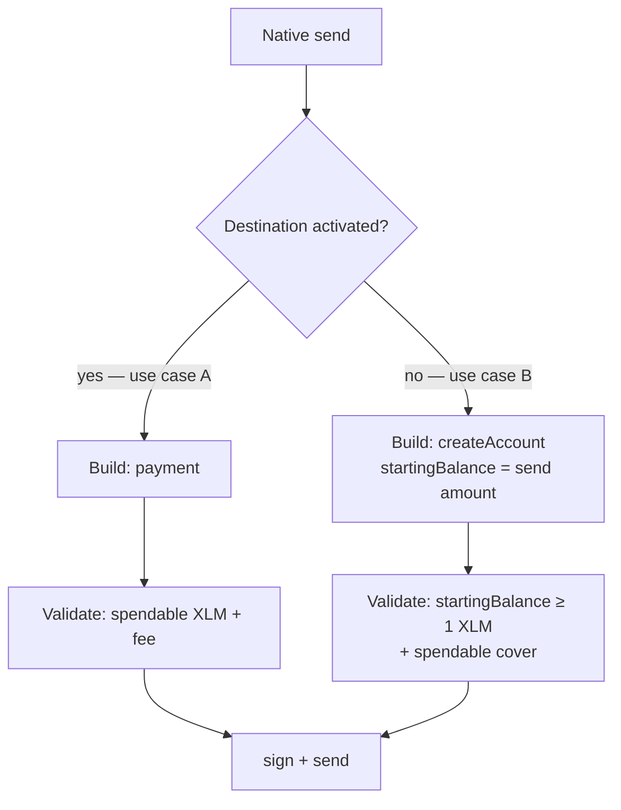

# Send native XLM

Native asset (slip44) send has two use cases, chosen by whether the destination is already funded on-chain.

| | |
| --- | --- |
| **Service** | `TransactionService.createValidatedSendTransaction` → `#createValidatedClassicAssetTransfer` |
| **Builder** | `TransactionBuilder.transfer` → `#send` or `#createAccount` |
| **Client** | [`onAmountInput`](../../use-cases/client-request/onAmountInput.md), [`confirmSend`](../../use-cases/client-request/confirmSend.md) |
| **Submit** | [Submit & bad-sequence retry](./submit-sequence-retry.md) |

Only **native / slip44** can fund a new account. Classic / SEP-41 sends to an unactivated destination fail earlier (`AccountNotActivatedException` / `InvalidAssetForCreateAccountException`).

## Cache

**Send / submit (`confirmSend`) does not use cache** (`useCache: false`). Destination load is always fresh so the envelope is safe to sign.

**Preflight only (`onAmountInput`)** passes `useCache: true` when building the validated send for amount checks. See [onAmountInput cache note](../../use-cases/client-request/onAmountInput.md#note-cache-usage).

---

## Use case A — destination is activated

Send XLM to an account that already exists on the network.

### Build

1. Load destination → activated (`destinationAccount !== null`).
2. Fetch base inclusion fee.
3. `TransactionBuilder.transfer` → `#send` → single `Operation.payment` (native asset).
4. Amount is normalized to human-readable Stellar units; sequence from sender `OnChainAccount`.

### Validate

Checks spendable native balance (after reserves) and that the sender can cover the payment plus network fee.

### Send

Sign → `sendTransaction` ([submit-sequence-retry](./submit-sequence-retry.md)).

---

## Use case B — destination is not activated

Fund a new Stellar account by sending native XLM. The Snap builds a **`createAccount`** op instead of `payment`.

### Build

1. Load destination → not activated (`destinationAccount === null`).
2. Fetch base inclusion fee.
3. `TransactionBuilder.transfer` → `#createAccount` → `Operation.createAccount({ destination, startingBalance })`.
4. **`startingBalance` = the send amount** (same value the user entered / confirmed). There is no separate “funding” field.

### Validate

- **`startingBalance` must be ≥ 1 XLM** (minimum when not sponsoring).
- Sender must have enough spendable native to cover that starting balance plus fee.

### Send

Sign → `sendTransaction` ([submit-sequence-retry](./submit-sequence-retry.md)).

---

## Flow

