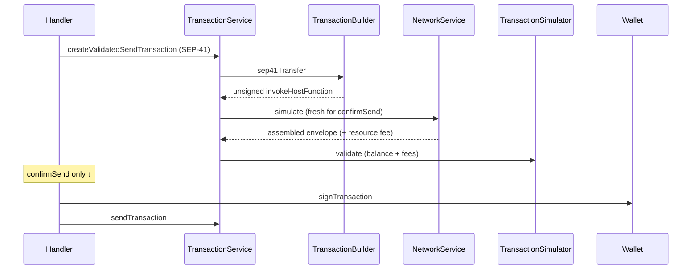

# Send SEP-41

Soroban contract token transfer (`SEP-41` CAIP-19 asset → `invokeHostFunction` calling `transfer`).

|             |                                                                                                                                    |
| ----------- | ---------------------------------------------------------------------------------------------------------------------------------- |
| **Service** | `TransactionService.createValidatedSendTransaction` → `#createValidatedSep41Transfer`                                              |
| **Builder** | `TransactionBuilder.sep41Transfer`                                                                                                 |
| **Client**  | [`onAmountInput`](../../use-cases/client-request/onAmountInput.md), [`confirmSend`](../../use-cases/client-request/confirmSend.md) |
| **Submit**  | [Submit & bad-sequence retry](./submit-sequence-retry.md)                                                                          |

## Build

1. Destination must already be **activated**; otherwise `AccountNotActivatedException` (no `createAccount` for SEP-41).
2. Fetch base inclusion fee.
3. `TransactionBuilder.sep41Transfer`:
   - Parse contract id from CAIP-19 asset reference.
   - Build one `invokeHostFunction` op: `transfer(from, to, amount)` with amount in token **smallest units** (i128) — no classic decimal normalize.
   - Source account + sequence come from the resolved `OnChainAccount`.
4. If the asset row is missing from the on-chain snapshot (`getRawAsset`), fetch SEP-41 balances from the network and attach a local balance.
5. Fail early if local balance &lt; amount (`InsufficientBalanceException`).
6. Network simulation attaches Soroban resource fee / footprint (`sorobanData`).

### Cache

**Send / submit paths (`confirmSend`) never use cache** (`useCache: false`). Destination load and SEP-41 simulation are always fresh so the envelope is safe to sign.

**Preflight only (`onAmountInput`)** passes `useCache: true` so repeated amount checks stay responsive (SEP-41 sim keyed by asset + sender + recipient + scope, not amount). That result must not be signed. See [onAmountInput cache note](../../use-cases/client-request/onAmountInput.md#note-cache-usage).

## Validate

Local checks after network simulation has attached the Soroban resource fee:

- Sender has enough of the SEP-41 token balance.
- Sender can cover inclusion + resource fees in XLM.
- Envelope is a single contract `transfer` invoke with a consistent source/sender.

## Send

1. `Wallet.signTransaction`.
2. `TransactionService.sendTransaction` — see [submit-sequence-retry](./submit-sequence-retry.md).
3. Sequence-only rebuild does **not** safely preserve Soroban `sorobanData`; on `txBadSeq` for invoke envelopes the caller should re-simulate / rebuild rather than relying on a blind sequence bump.

## Flow

