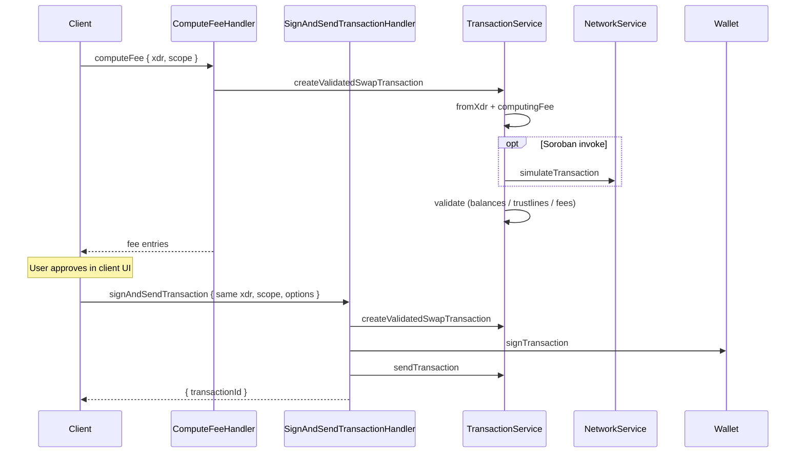

# Send swap / bridge (from XDR)

Swap and bridge envelopes are **not** built by `TransactionBuilder` inside the Snap. MetaMask CrossChain API supplies Base64 XDR; the Snap decodes, checks the accepted op shape, validates, then (for submit) signs and sends.

| | |
| --- | --- |
| **Service** | `TransactionService.createValidatedSwapTransaction` |
| **Decode** | `Transaction.fromXdr` |
| **Shape gate** | `SwapTransactionXdrStruct` ([`api/xdr.ts`](../../../src/api/xdr.ts)) |
| **Client** | [`computeFee`](../../use-cases/client-request/computeFee.md), [`signAndSendTransaction`](../../use-cases/client-request/signAndSendTransaction.md) |
| **Submit** | [Submit & bad-sequence retry](./submit-sequence-retry.md) |

## Accepted operation patterns from XDR

`SwapTransactionXdrStruct` only checks **operation kind + order** (not balances / memos). Downstream service + simulator do the rest.

| Ops (in order) | Meaning |
| --- | --- |
| `[invokeHostFunction]` | Soroban swap (single contract invoke) |
| `[payment]` | Bridge deposit (single payment to deposit account) **or** swap without a separate fee op |
| `[pathPayment*]` | Classic swap without a trailing fee payment |
| `[pathPayment*, payment]` | Classic swap + route fee payment |
| `[changeTrust, pathPayment*]` | Trustline setup then swap (no fee op) |
| `[payment, payment]` | Bridge: deposit payment + fee wallet payment |
| `[changeTrust, pathPayment*, payment]` | Trustline + classic swap + fee payment |

`pathPayment*` = `pathPaymentStrictSend` or `pathPaymentStrictReceive`.

Anything else → rejected at the JSON-RPC struct (`Unsupported swap transaction operation shape`).

## Build / decode

1. Client passes the **same** XDR used for `computeFee` into `signAndSendTransaction`.
2. `Transaction.fromXdr({ xdr, scope })`.
3. `computingFee(transaction)`:
   - If envelope has `invokeHostFunction` → `NetworkService.simulateTransaction` (fresh Soroban assemble / resource fee).
   - Else → keep fee already on the envelope (Bridge / classic quote trusted).
4. Preload participating accounts from the network (skipped for invoke-only envelopes).

## Validate

Local checks on the decoded envelope (balances, trustlines, fees) for whichever ops are present — e.g. path-payment amounts, trailing fee payment, leading change-trust, or Soroban invoke after simulation.

## Send

Only `signAndSendTransaction`:

1. `Wallet.signTransaction` (user consent is **client-side** — Snap shows no confirmation).
2. `sendTransaction` — see [submit-sequence-retry](./submit-sequence-retry.md).
3. Persist pending keyring tx as `Swap` (same-chain) or `BridgeSend` (cross-chain) from `options.sourceAssetId` / `destAssetId`.

## Flow

