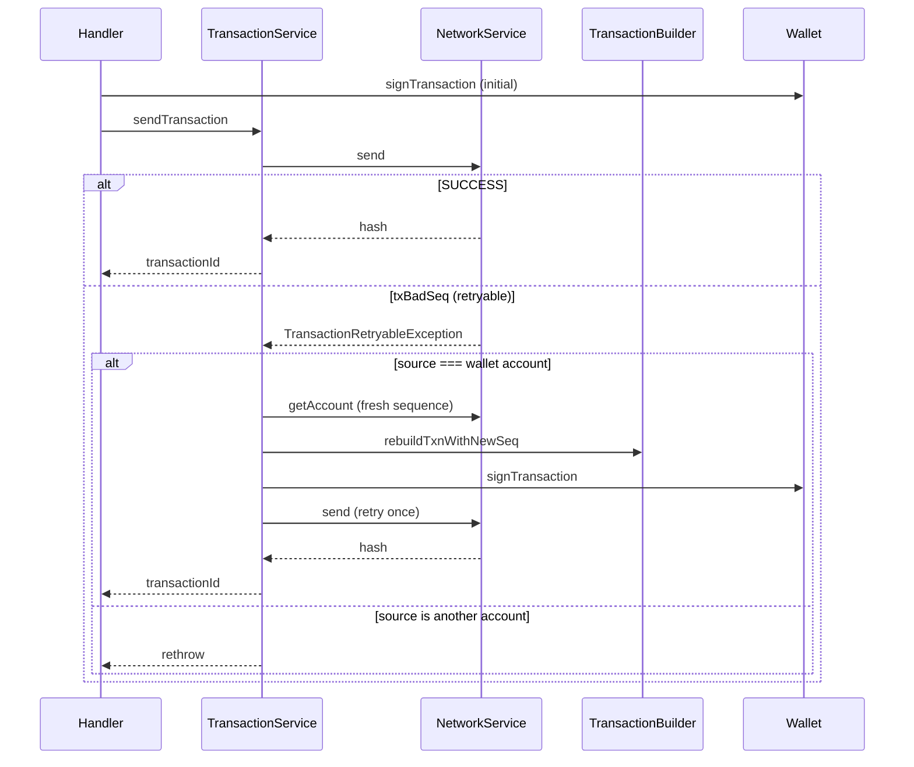

# Submit & bad-sequence retry (`txBadSeq`)

Shared on-chain **submit** path used after any flow has built (or decoded), validated, and signed an envelope. This doc is only about submission and recovering when the account **sequence is wrong or too old**.

Suggested name vs “general on-chain send”: prefer **submit / sequence retry** — it is not a payment-type chooser; it is the last mile of every successful submit.

| | |
| --- | --- |
| **Service** | `TransactionService.sendTransaction` |
| **Network** | `NetworkService.send` |
| **Rebuild** | `TransactionBuilder.rebuildTxnWithNewSeq` |
| **Used by** | [`confirmSend`](../../use-cases/client-request/confirmSend.md), [`changeTrustOpt`](../../use-cases/client-request/changeTrustOpt.md), [`signAndSendTransaction`](../../use-cases/client-request/signAndSendTransaction.md), … |

## Happy path

```text
assert scope matches envelope
  → NetworkService.send(signed tx)
  → optional poll for terminal SUCCESS
  → return transaction hash
```

## When sequence is stale (`txBadSeq`)

Stellar rejects the submit with `txBadSeq` when the envelope’s sequence does not match the source account’s current sequence (concurrent txs, race after a long confirmation dialog, etc.).

`NetworkService.send` maps that RPC error to `TransactionRetryableException`.

`TransactionService.sendTransaction` then:

1. Checks the envelope **source** equals the resolved `onChainAccount.accountId` (this wallet consumes the sequence).
   - If source is **another** account → rethrow (cannot bump someone else’s sequence).
2. Reloads the account from the network (`getAccount`) for a fresh `sequenceNumber`.
3. `rebuildTxnWithNewSeq` — clone ops / fee / timebounds onto a new envelope with the new sequence.
4. `wallet.signTransaction` again.
5. Submit **once** more.

Only **one** automatic retry.

## Soroban / `invokeHostFunction` caveat

Sequence-only rebuild copies classic-style fields and operations; it does **not** correctly preserve assembled Soroban `sorobanData`. JSDoc on `sendTransaction` states that for invoke envelopes, `txBadSeq` should not be treated as a safe auto-retry — the caller should **re-simulate / re-assemble** (e.g. fresh quote or fresh SEP-41 sim) instead of relying on a blind sequence bump.

## Flow



## After submit (callers)

Handlers typically then:

- `savePendingKeyringTransactionSafe`
- `TrackTransactionHandler.scheduleBackgroundEvent`
