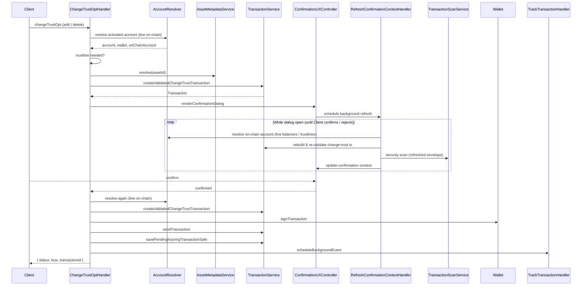

# Use case: `changeTrustOpt`

Add or remove a classic Stellar trustline for an asset on a managed account.

|             |                                                                                                  |
| ----------- | ------------------------------------------------------------------------------------------------ |
| **Entry**   | `onClientRequest` → `ClientRequestHandler` → `ChangeTrustOptHandler`                             |
| **Method**  | `changeTrustOpt` (`ClientRequestMethod.ChangeTrustOpt`)                                          |
| **Actions** | `add` (opt-in) · `delete` (opt-out, limit forced to `0`)                                         |
| **Source**  | [`handlers/clientRequest/changeTrustOpt.ts`](../../../src/handlers/clientRequest/changeTrustOpt.ts) |

## Request / response (shape)

**Request params**

- `accountId` — keyring account UUID
- `assetId` — CAIP-19 classic asset
- `scope` — CAIP-2 chain ID
- `action` — `"add"`  `"delete"`
- `limit` — optional; only for `"add"` (nonzero Stellar amount)

**Response**

- `{ status: true, transactionId }` — built, confirmed, signed, and submitted
- `{ status: true }` — opt-in already satisfied (trustline exists with limit > 0), or became redundant while the dialog was open
- `{ status: false }` — account not activated (funding prompt shown; not an RPC error)

User rejection of the confirmation dialog throws `UserRejectedRequestError`.

## Participants

| Component                           | Path                        | Role in this flow                                                    |
| ----------------------------------- | --------------------------- | -------------------------------------------------------------------- |
| `ClientRequestHandler`              | `handlers/clientRequest`    | Routes `changeTrustOpt` to the handler                               |
| `ChangeTrustOptHandler`             | `handlers/clientRequest`    | Orchestrates the use case                                            |
| `AccountResolver`                   | `handlers/`                 | Loads keyring account + wallet + **live** on-chain account (network) |
| `AccountService`                    | `services/account`          | Keyring account lookup (via resolver)                                |
| `WalletService` / `Wallet`          | `services/wallet`           | Signing key material + `signTransaction`                             |
| `OnChainAccountService`             | `services/on-chain-account` | Fetch fresh on-chain balances / trustlines                           |
| `AssetMetadataService`              | `services/asset-metadata`   | Resolve symbol / metadata for UI                                     |
| `TransactionService`                | `services/transaction`      | Build + validate change-trust tx; submit; save pending keyring tx    |
| `NetworkService`                    | `services/network`          | Base fee (via `TransactionService`)                                  |
| `ConfirmationUXController`          | `ui/confirmation`           | Opt-in / opt-out confirmation dialog                                 |
| `TransactionScanService`            | `services/transaction-scan` | Security scan while dialog is open                                   |
| `RefreshConfirmationContextHandler` | `handlers/cronjob`          | Re-validate tx / fees while dialog is open                           |
| `TrackTransactionHandler`           | `handlers/cronjob`          | Schedule background status tracking after submit                     |

## Step-by-step

1. **Route** — `onClientRequest` dispatches to `ChangeTrustOptHandler`.
2. **Resolve** — `AccountResolver` loads keyring account, wallet, and activated on-chain account from the **live network**. Unfunded accounts show the activation prompt and return `{ status: false }`.
3. **Short-circuit** — If `add` and a trustline with limit > 0 already exists → `{ status: true }`. If `delete` and no trustline → `TrustlineNotFoundException`.
4. **Build** — Resolve asset metadata; `TransactionService.createValidatedChangeTrustTransaction` builds a change-trust op (`delete` forces limit `"0"`).
5. **Confirm** — `ConfirmationUXController` shows opt-in or opt-out UI (fee, security scan, local re-validation cron while open).
6. **Refresh** — After confirm, account is resolved again from the live network; fee must not exceed what the user approved; redundant opt-in returns `{ status: true }` without submit.
7. **Sign & send** — `Wallet.signTransaction` → `TransactionService.sendTransaction`.
8. **Post-submit** — Persist pending keyring tx (`ChangeTrustOptIn` / `ChangeTrustOptOut`) and schedule `TrackTransactionHandler`.

## Sequence (happy path)

