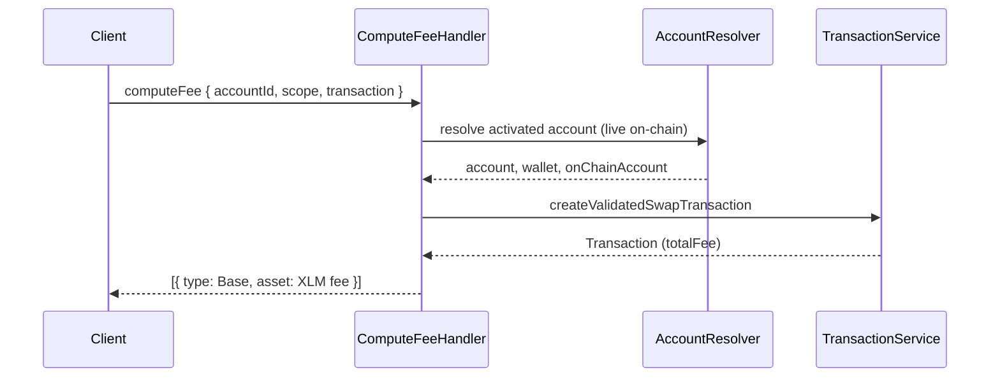

# Use case: `computeFee`

Quotes fees for a swap / bridge envelope from MetaMask CrossChain API (same validation path as `signAndSendTransaction`).

|                          |                                                                                             |
| ------------------------ | ------------------------------------------------------------------------------------------- |
| **Entry**                | `onClientRequest` → `ClientRequestHandler` → `ComputeFeeHandler`                            |
| **Method**               | `computeFee` (`ClientRequestMethod.ComputeFee`)                                             |
| **Source**               | [`handlers/clientRequest/computeFee.ts`](../../../src/handlers/clientRequest/computeFee.ts) |
| **Transaction pipeline** | [Swap / bridge from XDR](../../misc/transaction/send-swap.md)                               |

## Client workflow

1. After the user selects a quote, obtain the unsigned XDR from MetaMask CrossChain API.
2. Call **`computeFee`** with that XDR and `scope` so the user can review fees.
3. After approval in the client UI, call **`signAndSendTransaction`** with the **same** `transaction` XDR and `scope`.

## Request / response (shape)

**Request params**

- `accountId` — keyring account UUID
- `scope` — CAIP-2 chain ID
- `transaction` — Base64-encoded swap / bridge XDR
- `options` — optional (`visible`, `type`, `feeLimit`)

**Response**

- Array of fee entries: `[{ type: FeeType.Base, asset: { unit, type, amount, fungible } }]`
- On insufficient native balance / fee coverage, still returns a fee entry using the **required** amount (so the client can surface the shortfall)

No confirmation dialog; nothing is signed or submitted.

## Participants

| Component               | Path                        | Role in this flow                                                    |
| ----------------------- | --------------------------- | -------------------------------------------------------------------- |
| `ClientRequestHandler`  | `handlers/clientRequest`    | Routes `computeFee` to the handler                                   |
| `ComputeFeeHandler`     | `handlers/clientRequest`    | Orchestrates fee quoting                                             |
| `AccountResolver`       | `handlers/`                 | Loads keyring account + wallet + **live** on-chain account (network) |
| `AccountService`        | `services/account`          | Keyring account lookup (via resolver)                                |
| `OnChainAccountService` | `services/on-chain-account` | Balances for validation / simulation                                 |
| `TransactionService`    | `services/transaction`      | Decode, validate, simulate swap XDR; read `totalFee`                 |
| `NetworkService`        | `services/network`          | Fees / simulation network reads (via `TransactionService`)           |

## Step-by-step

1. **Route** — `onClientRequest` dispatches to `ComputeFeeHandler`.
2. **Resolve** — `AccountResolver` loads keyring account, wallet, and activated on-chain account from the **live network**.
3. **Validate** — `TransactionService.createValidatedSwapTransaction` (same path as sign-and-send, including Soroban simulation when needed).
4. **Return** — Base fee as display amount in native XLM; map balance/fee shortfalls to a required-amount fee entry.

## Sequence (happy path)

