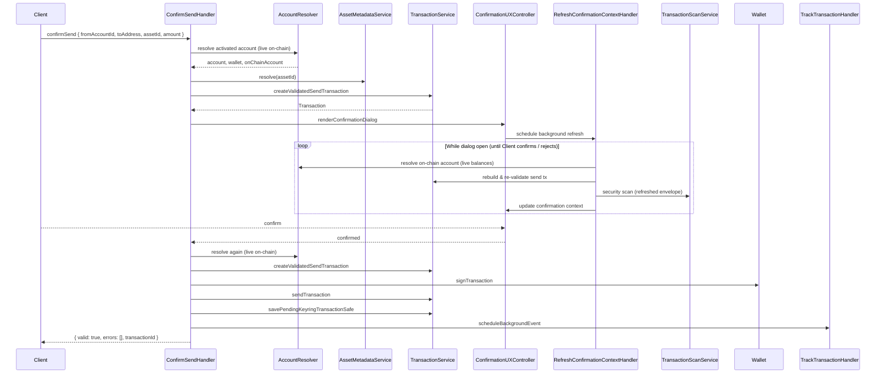

# Use case: `confirmSend`

Confirms and submits a send for Unified Non-EVM Send (live on-chain data at build and submit time).

|                          |                                                                                                                                                                |
| ------------------------ | -------------------------------------------------------------------------------------------------------------------------------------------------------------- |
| **Entry**                | `onClientRequest` → `ClientRequestHandler` → `ConfirmSendHandler`                                                                                              |
| **Method**               | `confirmSend` (`ClientRequestMethod.ConfirmSend`)                                                                                                              |
| **Source**               | [`handlers/clientRequest/confirmSend.ts`](../../../src/handlers/clientRequest/confirmSend.ts)                                                                  |
| **Transaction pipeline** | [SEP-41](../../misc/transaction/send-sep41.md) · [classic](../../misc/transaction/send-classic-trustline.md) · [native](../../misc/transaction/send-native.md) |

## Request / response (shape)

**Request params**

- `fromAccountId` — keyring account UUID (coerced to `accountId` internally)
- `toAddress` — Stellar destination
- `assetId` — CAIP-19 classic / SEP-41 / slip44 (`scope` derived from `assetId`)
- `amount` — human-readable amount string

**Response**

- `{ valid: true, errors: [], transactionId }` — confirmed, signed, and submitted
- `{ valid: false, errors: [{ code }] }` — `Invalid` · `InsufficientBalance` · `InsufficientBalanceToCoverFee`

User rejection of the confirmation dialog throws `UserRejectedRequestError`. Unactivated accounts return `{ valid: false, errors: [{ code: "Invalid" }] }` (no activation prompt).

## Participants

| Component                           | Path                        | Role in this flow                                          |
| ----------------------------------- | --------------------------- | ---------------------------------------------------------- |
| `ClientRequestHandler`              | `handlers/clientRequest`    | Routes `confirmSend` to the handler                        |
| `ConfirmSendHandler`                | `handlers/clientRequest`    | Orchestrates the use case                                  |
| `AccountResolver`                   | `handlers/`                 | Loads keyring account + wallet + **live** on-chain account |
| `AccountService`                    | `services/account`          | Keyring account lookup (via resolver)                      |
| `WalletService` / `Wallet`          | `services/wallet`           | Signing key material + `signTransaction`                   |
| `OnChainAccountService`             | `services/on-chain-account` | Fresh balances / sequence                                  |
| `AssetMetadataService`              | `services/asset-metadata`   | Decimals, symbol, metadata for UI                          |
| `TransactionService`                | `services/transaction`      | Build + validate send; submit; save pending keyring tx     |
| `NetworkService`                    | `services/network`          | Base fee / network reads (via `TransactionService`)        |
| `ConfirmationUXController`          | `ui/confirmation`           | Send confirmation dialog                                   |
| `TransactionScanService`            | `services/transaction-scan` | Security scan while dialog is open                         |
| `RefreshConfirmationContextHandler` | `handlers/cronjob`          | Refresh balances, tx, and scan while dialog is open        |
| `TrackTransactionHandler`           | `handlers/cronjob`          | Schedule background status tracking after submit           |

## Step-by-step

1. **Route** — `onClientRequest` dispatches to `ConfirmSendHandler`.
2. **Resolve** — `AccountResolver` loads keyring account, wallet, and activated on-chain account from the **live network**.
3. **Build** — Resolve asset metadata; convert amount; `TransactionService.createValidatedSendTransaction`.
4. **Confirm** — `ConfirmationUXController` shows send UI (fee, estimated changes, security scan, local re-validation cron while open).
5. **Refresh** — After confirm, account is resolved again from the live network; fee must not exceed what the user approved.
6. **Sign & send** — `Wallet.signTransaction` → `TransactionService.sendTransaction`.
7. **Post-submit** — Persist pending keyring tx (`Send`) and schedule `TrackTransactionHandler` for sender + destination.

## Sequence (happy path)

