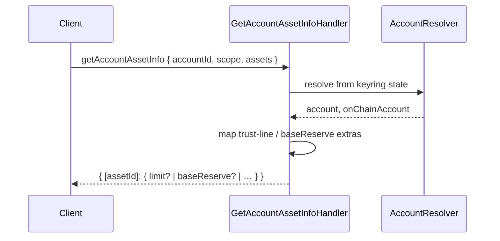

# Use case: `getAccountAssetInfo`

Returns per-asset enrichment for portfolio / trust-line UX (classic trust-line fields or native XLM base reserve).

| | |
| --- | --- |
| **Entry** | `onClientRequest` → `ClientRequestHandler` → `GetAccountAssetInfoHandler` |
| **Method** | `getAccountAssetInfo` (`ClientRequestMethod.GetAccountAssetInfo`) |
| **Source** | [`handlers/clientRequest/getAccountAssetInfo.ts`](../../../src/handlers/clientRequest/getAccountAssetInfo.ts) |

## Request / response (shape)

**Request params**

- `accountId` — keyring account UUID
- `scope` — CAIP-2 chain ID
- `assets` — list of CAIP-19 classic / SEP-41 / slip44 asset ids

**Response**

Map keyed by asset id → optional extras:

| Asset kind | Fields |
| --- | --- |
| Classic | `limit`, optional `authorized`, optional `sponsored` |
| Native (slip44) | `baseReserve` |
| Missing / unsupported | `{}` |

Unactivated accounts return empty extras per asset (`{}`) instead of showing the activation prompt (portfolio-import friendly).

## Participants

| Component | Path | Role in this flow |
| --- | --- | --- |
| `ClientRequestHandler` | `handlers/clientRequest` | Routes `getAccountAssetInfo` to the handler |
| `GetAccountAssetInfoHandler` | `handlers/clientRequest` | Builds per-asset extras from on-chain snapshot |
| `AccountResolver` | `handlers/` | Loads account + on-chain snapshot from **state** |
| `AccountService` | `services/account` | Keyring account lookup (via resolver) |
| `OnChainAccountService` | `services/on-chain-account` | Persisted balances / trustlines (via resolver) |

No confirmation UI, signing, or transaction build.

## Step-by-step

1. **Route** — `onClientRequest` dispatches to `GetAccountAssetInfoHandler`.
2. **Resolve** — `AccountResolver` loads keyring account and on-chain account from snap state.
3. **Map assets** — For each requested id: native → `baseReserve`; classic → trust-line fields from `getRawAsset` (includes zero-limit / tombstone rows); others skipped or `{}`.
4. **Return** — Record of extras keyed by asset id.

## Sequence (happy path)

