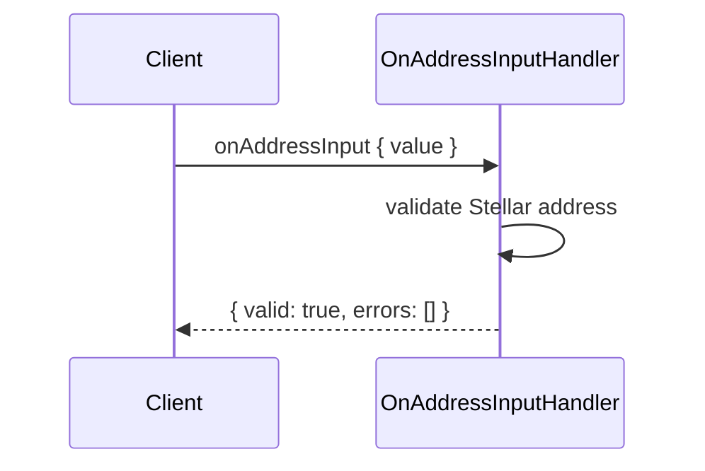

# Use case: `onAddressInput`

Validates a Stellar destination address for Unified Non-EVM Send (as the user types).

| | |
| --- | --- |
| **Entry** | `onClientRequest` → `ClientRequestHandler` → `OnAddressInputHandler` |
| **Method** | `onAddressInput` (`ClientRequestMethod.OnAddressInput`) |
| **Source** | [`handlers/clientRequest/onAddressInput.ts`](../../../src/handlers/clientRequest/onAddressInput.ts) |

## Request / response (shape)

**Request params**

- `value` — Stellar address string to validate

**Response**

- `{ valid: true, errors: [] }` — address is a valid Stellar address
- `{ valid: false, errors: [{ code: "Invalid" }] }` — validation failed

No account resolution, confirmation UI, or network calls.

## Participants

| Component | Path | Role in this flow |
| --- | --- | --- |
| `ClientRequestHandler` | `handlers/clientRequest` | Routes `onAddressInput` to the handler |
| `OnAddressInputHandler` | `handlers/clientRequest` | Validates params via Superstruct |

## Step-by-step

1. **Route** — `onClientRequest` dispatches to `OnAddressInputHandler`.
2. **Validate** — Request is checked against `OnAddressInputJsonRpcRequestStruct` (`value` must be a Stellar address).
3. **Return** — `{ valid: true }` on success, or `{ valid: false, errors: [{ code: "Invalid" }] }` when params fail.

## Sequence (happy path)

