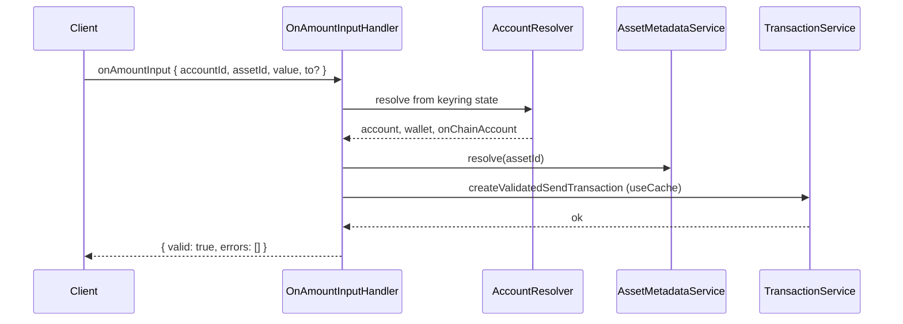

# Use case: `onAmountInput`

Preflight-validates a send amount while the user types (balance and fee checks only; nothing is signed or submitted).

| | |
| --- | --- |
| **Entry** | `onClientRequest` → `ClientRequestHandler` → `OnAmountInputHandler` |
| **Method** | `onAmountInput` (`ClientRequestMethod.OnAmountInput`) |
| **Source** | [`handlers/clientRequest/onAmountInput.ts`](../../../src/handlers/clientRequest/onAmountInput.ts) |
| **Transaction pipeline** | [SEP-41](../../misc/transaction/send-sep41.md) · [classic](../../misc/transaction/send-classic-trustline.md) · [native](../../misc/transaction/send-native.md) |

## Request / response (shape)

**Request params**

- `accountId` — keyring account UUID
- `assetId` — CAIP-19 classic / SEP-41 / slip44 asset (`scope` is derived from `assetId`)
- `value` — positive amount string (human-readable units)
- `to` — optional Stellar destination; omitted → self-transfer validation

**Response**

- `{ valid: true, errors: [] }` — amount can fund a send (incl. fee)
- `{ valid: false, errors: [{ code }] }` — `Invalid` · `InsufficientBalance` · `InsufficientBalanceToCoverFee`

Unactivated accounts return `{ valid: false, errors: [{ code: "Invalid" }] }` (no activation prompt).

## Participants

| Component | Path | Role in this flow |
| --- | --- | --- |
| `ClientRequestHandler` | `handlers/clientRequest` | Routes `onAmountInput` to the handler |
| `OnAmountInputHandler` | `handlers/clientRequest` | Orchestrates preflight validation |
| `AccountResolver` | `handlers/` | Loads account + wallet + on-chain snapshot from **state** |
| `AccountService` | `services/account` | Keyring account lookup (via resolver) |
| `OnChainAccountService` | `services/on-chain-account` | Persisted on-chain balances (via resolver) |
| `AssetMetadataService` | `services/asset-metadata` | Decimals for amount conversion |
| `TransactionService` | `services/transaction` | Build + validate send tx (`useCache: true`) |

## Step-by-step

1. **Route** — `onClientRequest` dispatches to `OnAmountInputHandler`.
2. **Resolve** — `AccountResolver` loads keyring account, wallet, and on-chain account from snap state.
3. **Convert** — Resolve asset metadata; convert `value` to smallest units; reject if sub-unit decimals remain.
4. **Preflight** — `TransactionService.createValidatedSendTransaction` with cached network reads (destination defaults to sender).
5. **Return** — Structured validation result; expected balance/fee failures are returned as error codes (not thrown).

## Note: cache usage

`onAmountInput` is the **only** client send path that passes `useCache: true`. Real send/submit (`confirmSend`) always uses `useCache: false` (fresh destination load + fresh SEP-41 simulation).

For **SEP-41**, that preflight cache matters most:

- Fee estimation needs an on-chain **simulation**. Without caching, every keystroke would hit RPC.
- Simulation is reused and keyed by **asset, sender, recipient, and scope** — **not** by amount. Cached XDR may carry a **stale amount or sequence** — never sign it.
- Balance is still checked **locally** before simulation, so insufficient funds fail fast.

Classic / native preflight still uses `useCache: true` for destination-account / network reads so typing stays responsive; submit paths do not.

## Sequence (happy path)

