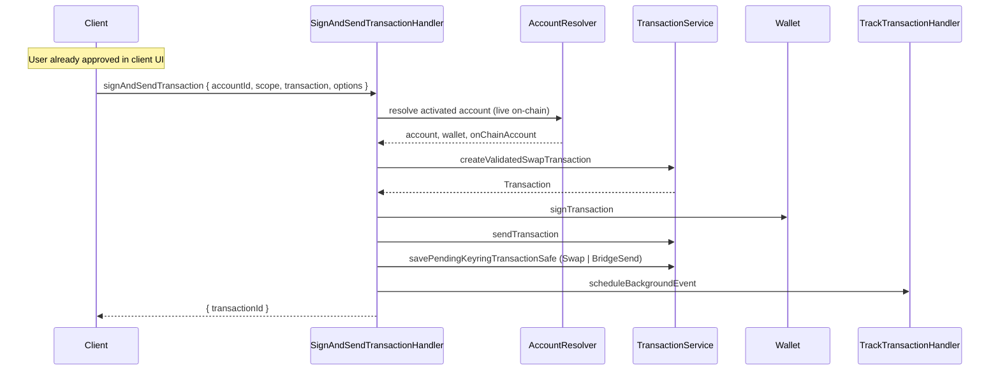

# Use case: `signAndSendTransaction`

Signs and submits a swap / bridge envelope previously quoted via `computeFee`. **No Snap confirmation dialog** — the caller must obtain user consent first.

|                          |                                                                                                                     |
| ------------------------ | ------------------------------------------------------------------------------------------------------------------- |
| **Entry**                | `onClientRequest` → `ClientRequestHandler` → `SignAndSendTransactionHandler`                                        |
| **Method**               | `signAndSendTransaction` (`ClientRequestMethod.SignAndSendTransaction`)                                             |
| **Source**               | [`handlers/clientRequest/signAndSendTransaction.ts`](../../../src/handlers/clientRequest/signAndSendTransaction.ts) |
| **Transaction pipeline** | [Swap / bridge from XDR](../../misc/transaction/send-swap.md)                                                       |

## Client workflow

1. Quote fees with **`computeFee`** using the CrossChain API XDR.
2. Obtain explicit user approval in the **client** UI.
3. Call **`signAndSendTransaction`** with the **same** `transaction` XDR, `scope`, and swap asset options.

## Request / response (shape)

**Request params**

- `accountId` — keyring account UUID
- `scope` — CAIP-2 chain ID
- `transaction` — Base64-encoded swap / bridge XDR (same as `computeFee`)
- `options.sourceAssetId` — Stellar source asset (CAIP-19 / slip44)
- `options.destAssetId` — destination asset (CAIP-19; may be another chain for bridges)
- `options.visible` / `options.type` — optional

**Response**

- `{ transactionId }` — submitted transaction hash

## Security note

This handler does **not** show a Snap confirmation. The client is responsible for displaying details and obtaining approval before calling. Signing without caller-side consent is a critical vulnerability.

## Participants

| Component                       | Path                        | Role in this flow                                                    |
| ------------------------------- | --------------------------- | -------------------------------------------------------------------- |
| `ClientRequestHandler`          | `handlers/clientRequest`    | Routes `signAndSendTransaction` to the handler                       |
| `SignAndSendTransactionHandler` | `handlers/clientRequest`    | Orchestrates validate → sign → submit                                |
| `AccountResolver`               | `handlers/`                 | Loads keyring account + wallet + **live** on-chain account (network) |
| `AccountService`                | `services/account`          | Keyring account lookup (via resolver)                                |
| `WalletService` / `Wallet`      | `services/wallet`           | `signTransaction`                                                    |
| `OnChainAccountService`         | `services/on-chain-account` | Balances / sequence for validation                                   |
| `AssetMetadataService`          | `services/asset-metadata`   | Same-chain swap asset labels for pending tx                          |
| `TransactionService`            | `services/transaction`      | Validate swap XDR; submit; save pending keyring tx                   |
| `TrackTransactionHandler`       | `handlers/cronjob`          | Schedule background status tracking after submit                     |

## Step-by-step

1. **Route** — `onClientRequest` dispatches to `SignAndSendTransactionHandler`.
2. **Resolve** — `AccountResolver` loads keyring account, wallet, and activated on-chain account from the **live network**.
3. **Validate** — `TransactionService.createValidatedSwapTransaction` on the XDR.
4. **Sign & send** — `Wallet.signTransaction` → `TransactionService.sendTransaction`.
5. **Post-submit** — Persist pending keyring tx (`Swap` for same-chain, `BridgeSend` for cross-chain) and schedule `TrackTransactionHandler`.

## Sequence (happy path)

