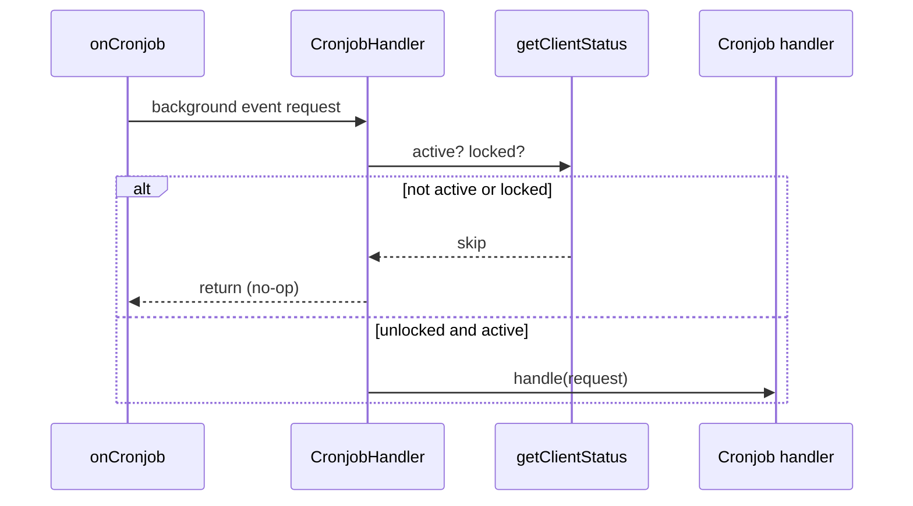

# Use case: cronjob gate (`CronjobHandler`)

All background events enter through `onCronjob` → `CronjobHandler`, which **skips work when MetaMask is inactive or the wallet is locked**.

|            |                                                                           |
| ---------- | ------------------------------------------------------------------------- |
| **Entry**  | `onCronjob` → `CronjobHandler`                                            |
| **Source** | [`handlers/cronjob/cronjob.ts`](../../../src/handlers/cronjob/cronjob.ts) |

## Behavior

1. Call `getClientStatus()` → `{ active, locked }`.
2. If **`!active` or `locked`** → return immediately (no method dispatch, no side effects).
3. Otherwise validate `request.method` against `BackgroundEventMethod` and route to the matching handler.

This gate applies to **every** cron method (`trackTransaction`, `synchronizeAccounts`, `synchronizeAssets`, `refreshConfirmationContext`). Individual handlers do not re-check lock state.

## Cronjob handlers

| Cronjob handlers             | Doc                                                              |
| ---------------------------- | ---------------------------------------------------------------- |
| `trackTransaction`           | [trackTransaction.md](./trackTransaction.md)                     |
| `synchronizeAccounts`        | [syncAccounts.md](./syncAccounts.md)                             |
| `synchronizeAssets`          | [syncAssets.md](./syncAssets.md)                                 |
| `refreshConfirmationContext` | [refreshConfirmationContext.md](./refreshConfirmationContext.md) |

## Sequence

