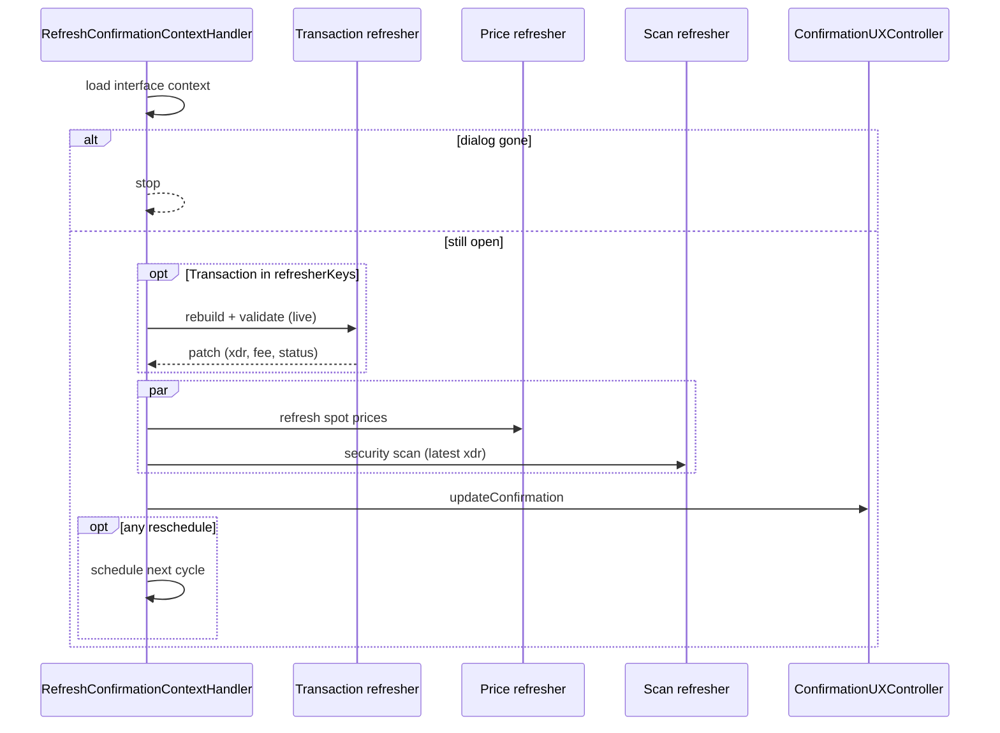

# Use case: `refreshConfirmationContext`

While a confirmation dialog is open, periodically refresh prices, security scan, and/or rebuild the pending transaction against live on-chain state.

| | |
| --- | --- |
| **Entry** | `onCronjob` → `CronjobHandler` → `RefreshConfirmationContextHandler` |
| **Method** | `refreshConfirmationContext` (`BackgroundEventMethod.RefreshConfirmationContext`) |
| **Source** | [`handlers/cronjob/refreshConfirmationContext/`](../../../src/handlers/cronjob/refreshConfirmationContext/) |
| **Gate** | Skipped when wallet locked / inactive — see [cronjob.md](./cronjob.md) |

Scheduled by `ConfirmationUXController` when a dialog opens with pricing, security scanning, and/or local simulation enabled (e.g. [`confirmSend`](../client-request/confirmSend.md), [`changeTrustOpt`](../client-request/changeTrustOpt.md)).

## Request params

- `interfaceId` — Snap UI interface id
- `interfaceKey` — which confirmation view
- `scope` — CAIP-2 chain ID
- `refresherKeys` — which slices to run this cycle: `Prices` · `Scan` · `Transaction`

## Participants

| Component | Path | Role |
| --- | --- | --- |
| `RefreshConfirmationContextHandler` | `handlers/cronjob` | Orchestrate refreshers, re-render, reschedule |
| `ConfirmationPriceRefresher` | `handlers/cronjob/.../priceRefresher` | Spot prices via `PriceService` |
| `ConfirmationScanRefresher` | `handlers/cronjob/.../scanRefresher` | Blockaid / security scan via `TransactionScanService` |
| `ConfirmationTransactionRefresher` | `handlers/cronjob/.../transactionRefresher` | Rebuild + re-validate pending tx (live account) |
| `ConfirmationUXController` | `ui/confirmation` | Apply patched context to the open dialog |

## Refreshers

### Prices

Fetches / updates token spot prices shown on the confirmation (fee asset, send asset, etc.). Requests reschedule while pricing is still needed and not in a terminal error state.

### Security scan

Runs (or refreshes) the remote security scan on the current transaction envelope in context. Uses the **latest** envelope when the transaction refresher has already patched it this cycle.

### Transaction rebuild

Runs **first** when enabled:

1. Resolve live on-chain account.
2. Rebuild the pending send / change-trust envelope (fresh fee, sequence, time bounds).
3. Re-validate locally; update fee / validation status in context.
4. Write the rebuilt XDR into the security-scan request so the scan refresher does not scan a stale snapshot.

## Step-by-step (one cycle)

1. Resolve enabled refreshers from `refresherKeys`.
2. Load interface context; if the dialog was dismissed → stop (no reschedule).
3. Run **transaction** refresher alone (if selected), merge its patch.
4. Run **prices** and **scan** in parallel on the updated context.
5. Merge patches → `ConfirmationUXController.updateConfirmation`.
6. If any refresher asks to **reschedule** → schedule the next `refreshConfirmationContext` event.

## Sequence

