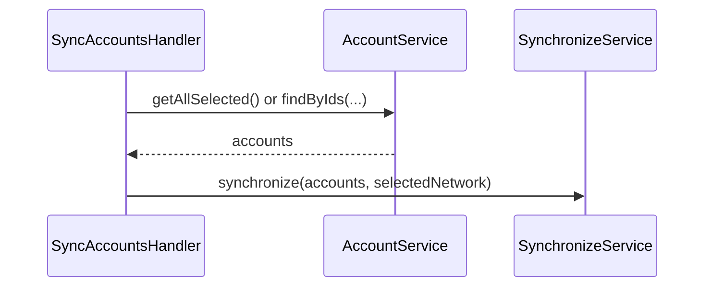

# Use case: `synchronizeAccounts`

Periodically (or on demand) refresh on-chain account state and transaction history for keyring accounts.

| | |
| --- | --- |
| **Entry** | `onCronjob` → `CronjobHandler` → `SyncAccountsHandler` |
| **Method** | `synchronizeAccounts` (`BackgroundEventMethod.SynchronizeAccounts`) |
| **Source** | [`handlers/cronjob/syncAccounts.ts`](../../../src/handlers/cronjob/syncAccounts.ts) |
| **Synchronization** | [synchronization](../../misc/synchronization/synchronization.md) |
| **Gate** | Skipped when wallet locked / inactive — see [cronjob.md](./cronjob.md) |

Also schedulable via `SyncAccountsHandler.scheduleBackgroundEvent` (e.g. after account changes). Declarative cron may omit params → treat as **selected** accounts.

## Request params

- `accountIds` — optional
  - omitted / `'selected'` → all **selected** keyring accounts
  - UUID array → those account ids only

Scope comes from `AppConfig.selectedNetwork`.

## Participants

| Component | Path | Role |
| --- | --- | --- |
| `SyncAccountsHandler` | `handlers/cronjob` | Resolve which accounts to sync |
| `AccountService` | `services/account` | `getAllSelected` / `findByIds` |
| `SynchronizeService` | `services/sync` | Sync balances, trustlines, transactions for those accounts |

## Step-by-step

1. Resolve account list (`selected` vs explicit ids).
2. `SynchronizeService.synchronize(accounts, { scope })` — updates on-chain snapshots and related history for the configured network.

## Sequence

