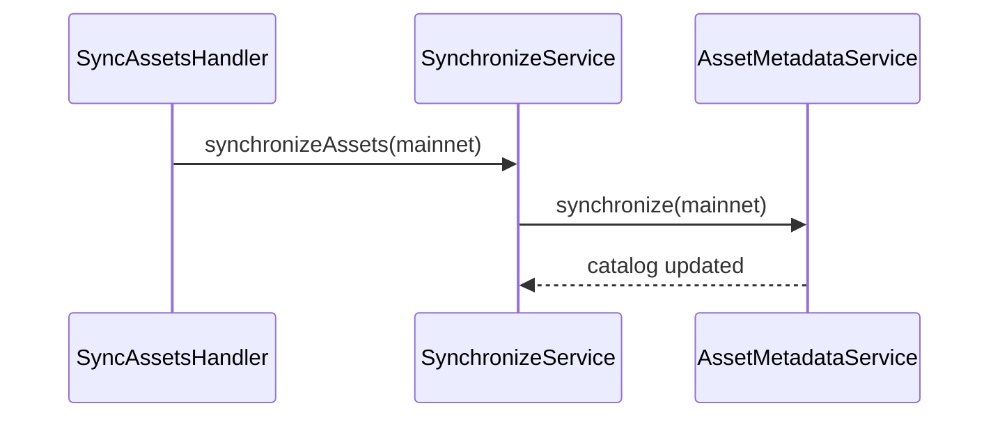

# Use case: `synchronizeAssets`

Refresh the Snap’s asset metadata catalog from the token API (mainnet only).

| | |
| --- | --- |
| **Entry** | `onCronjob` → `CronjobHandler` → `SyncAssetsHandler` |
| **Method** | `synchronizeAssets` (`BackgroundEventMethod.SynchronizeAssets`) |
| **Source** | [`handlers/cronjob/syncAssets.ts`](../../../src/handlers/cronjob/syncAssets.ts) |
| **Synchronization** | [synchronization](../../misc/synchronization/synchronization.md) |
| **Gate** | Skipped when wallet locked / inactive — see [cronjob.md](./cronjob.md) |

Declarative cron in `snap.manifest.json` (no params required).

## Participants

| Component | Path | Role |
| --- | --- | --- |
| `SyncAssetsHandler` | `handlers/cronjob` | Cron entry |
| `SynchronizeService` | `services/sync` | `synchronizeAssets(scope)` |
| `AssetMetadataService` | `services/asset-metadata` | Pull / persist asset catalog |

## Step-by-step

1. Always use **mainnet** scope (`KnownCaip2ChainId.Mainnet`) — asset metadata is only available there, regardless of the user’s selected network.
2. `SynchronizeService.synchronizeAssets` → `AssetMetadataService.synchronize`.
3. Failures are logged / tracked; the cron does not throw through to fail the whole Snap lifecycle aggressively.

## Sequence

