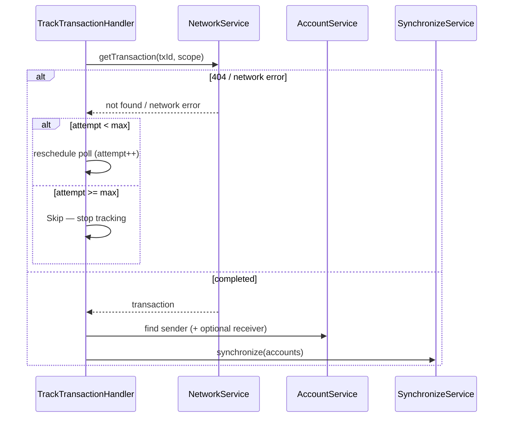

# Use case: `trackTransaction`

After a tx is submitted, keep polling Horizon until it shows up, then refresh the affected accounts’ balances / history.

|                     |                                                                                             |
| ------------------- | ------------------------------------------------------------------------------------------- |
| **Entry**           | `onCronjob` → `CronjobHandler` → `TrackTransactionHandler`                                  |
| **Method**          | `trackTransaction` (`BackgroundEventMethod.TrackTransaction`)                               |
| **Source**          | [`handlers/cronjob/trackTransaction.ts`](../../../src/handlers/cronjob/trackTransaction.ts) |
| **Synchronization** | [synchronization](../../misc/synchronization/synchronization.md)                            |
| **Gate**            | Skipped when wallet locked / inactive — see [cronjob.md](./cronjob.md)                      |

Scheduled right after submit by [`confirmSend`](../client-request/confirmSend.md), [`changeTrustOpt`](../client-request/changeTrustOpt.md), [`signAndSendTransaction`](../client-request/signAndSendTransaction.md).

## Request params

- `txId` — Stellar transaction hash
- `scope` — CAIP-2 chain ID
- `accountIdsOrAddresses` — `[senderAccountUuid]` or `[senderAccountUuid, receiverAddress]`
- `attempt` — optional reschedule counter (default `0`)

## What Horizon returns

| Outcome             | Meaning                                           |
| ------------------- | ------------------------------------------------- |
| **404 / not found** | Not indexed yet (or unknown hash)                 |
| **Found + success** | On-chain succeeded → keyring status **Confirmed** |
| **Found + fail**    | On-chain failed → keyring status **Failed**       |

Both found outcomes are **terminal** — settlement is done; sync accounts.

## Participants

| Component                 | Path               | Role                                                |
| ------------------------- | ------------------ | --------------------------------------------------- |
| `TrackTransactionHandler` | `handlers/cronjob` | Poll Horizon, reschedule, sync on settle            |
| `NetworkService`          | `services/network` | `getTransaction` from Horizon                       |
| `AccountService`          | `services/account` | Resolve sender / optional receiver keyring accounts |
| `SynchronizeService`      | `services/sync`    | Refresh balances / history after settle             |

## Step-by-step

1. Ask Horizon for `txId`.
2. **404 / not found** or **network error**:
   - If `attempt < trackTransactionMaxReschedules` → reschedule another poll (~2s, `attempt++`).
   - If **max attempts reached** → **skip** (stop tracking this tx; no further reschedule). Periodic `synchronizeAccounts` may still pick it up later.
3. **Found (confirmed or failed)** → load sender (and receiver if it is in the keyring) → `SynchronizeService.synchronize`.
4. Any other unexpected error → log / track; skip further tracking for this run.

## Sequence

