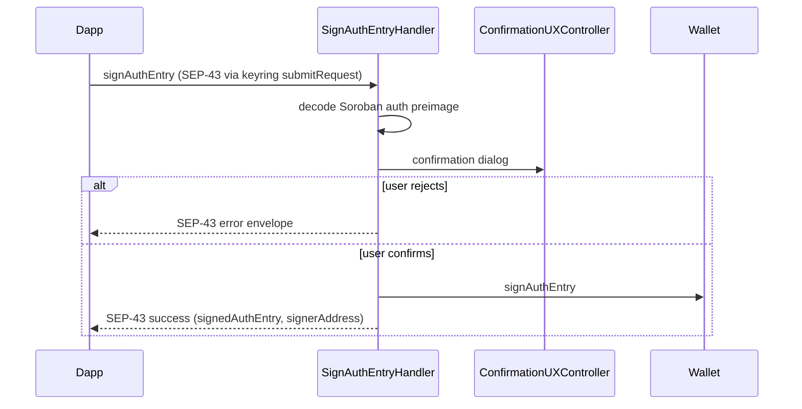

# Use case: `signAuthEntry`

SEP-43: confirm and sign a Soroban authorization preimage (`HashIdPreimage` / `envelopeTypeSorobanAuthorization`).

|              |                                                                                       |
| ------------ | ------------------------------------------------------------------------------------- |
| **Entry**    | `onKeyringRequest` → `KeyringHandler.submitRequest` → `SignAuthEntryHandler`          |
| **Method**   | `signAuthEntry` (`MultichainMethod.SignAuthEntry`)                                    |
| **Source**   | [`handlers/keyring/signAuthEntry.ts`](../../../src/handlers/keyring/signAuthEntry.ts) |
| **Overview** | [keyring.md](./keyring.md)                                                            |

## Participants

| Component                  | Path               | Role                          |
| -------------------------- | ------------------ | ----------------------------- |
| `SignAuthEntryHandler`     | `handlers/keyring` | Decode, confirm, sign         |
| `AccountResolver`          | `handlers/`        | Load keyring account + wallet |
| `Wallet`                   | `services/wallet`  | `signAuthEntry`               |
| `ConfirmationUXController` | `ui/confirmation`  | Sign-auth-entry dialog        |

## Request / response

Wire format follows **SEP-43** `signAuthEntry` (via keyring `submitRequest`):

- [SEP-43](https://github.com/stellar/stellar-protocol/blob/master/ecosystem/sep-0043.md)
- Keyring transport: [Account Management API](https://docs.metamask.io/snaps/reference/keyring-api/account-management/) (`keyring_submitRequest`)

Local validators: [`handlers/keyring/api.ts`](../../../src/handlers/keyring/api.ts) (`SignAuthEntryRequestStruct` / `SignAuthEntryResponseStruct`).

The dapp supplies a base64 `HashIdPreimage`. The Snap decodes it for the confirmation UI (contract, function, args, nested invocations, nonce, expiry ledger), then on approve signs `sha256(preimage)` with ed25519. Network id is already inside the preimage (mainnet-only validation at the struct layer).

## Step-by-step

1. Resolve account + wallet.
2. Decode preimage into a readable auth summary for the UI.
3. Show confirmation.
4. On approve → `wallet.signAuthEntry` → return signature.
5. On reject → SEP-43 error envelope.

## Sequence

