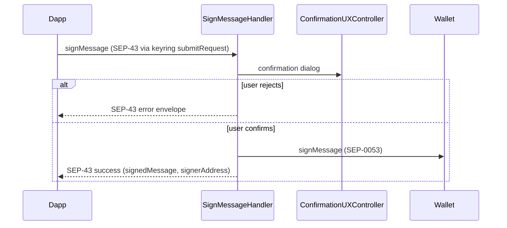

# Use case: `signMessage`

SEP-43: confirm and sign an arbitrary message (UTF-8 or base64 bytes).

| | |
| --- | --- |
| **Entry** | `onKeyringRequest` → `KeyringHandler.submitRequest` → `SignMessageHandler` |
| **Method** | `signMessage` (`MultichainMethod.SignMessage`) |
| **Source** | [`handlers/keyring/signMessage.ts`](../../../src/handlers/keyring/signMessage.ts) |
| **Overview** | [keyring.md](./keyring.md) |

## Participants

| Component | Path | Role |
| --- | --- | --- |
| `SignMessageHandler` | `handlers/keyring` | Confirm + sign |
| `AccountResolver` | `handlers/` | Load keyring account + wallet |
| `Wallet` | `services/wallet` | `signMessage` |
| `ConfirmationUXController` | `ui/confirmation` | Sign-message dialog |

## Request / response

Wire format follows **SEP-43** `signMessage` (via keyring `submitRequest`):

- [SEP-43](https://github.com/stellar/stellar-protocol/blob/master/ecosystem/sep-0043.md) — keyring method + params/response envelope
- Keyring transport: [Account Management API](https://docs.metamask.io/snaps/reference/keyring-api/account-management/) (`keyring_submitRequest`)

Local validators: [`handlers/keyring/api.ts`](../../../src/handlers/keyring/api.ts) (`SignMessageRequestStruct` / `SignMessageResponseStruct`).

## How signing works

Signing follows the **Stellar Signed Message** protocol ([SEP-0053](https://github.com/stellar/stellar-protocol/blob/master/ecosystem/sep-0053.md)), implemented in [`Wallet.signMessage`](../../../src/services/wallet/Wallet.ts):

1. **Interpret `message`** (SEP-43 allows UTF-8 text or base64-encoded bytes):
   - If the string is valid base64 → decode to raw bytes.
   - Otherwise → treat as UTF-8 text.
2. **Build the payload** — prepend the fixed prefix `Stellar Signed Message:\n`, then append the message bytes.
3. **Hash** — SHA-256 over that byte sequence.
4. **Sign** — Ed25519 sign the digest with the account’s keypair.
5. **Return** — base64-encoded signature as `signedMessage` (SEP-43 response).

The confirmation UI decodes base64 `message` to UTF-8 for display when possible, but **what gets signed** always follows the rules above (same detection as step 1).

**References**

| Spec | Role |
| --- | --- |
| [SEP-43](https://github.com/stellar/stellar-protocol/blob/master/ecosystem/sep-0043.md) | Keyring `signMessage` request/response wire format |
| [SEP-0053](https://github.com/stellar/stellar-protocol/blob/master/ecosystem/sep-0053.md) | Stellar Signed Message prefix, hash, and signature algorithm |

## Step-by-step

1. Resolve keyring account + wallet for the signer.
2. Show confirmation (message shown as UTF-8 when base64; signing still uses SEP-0053 rules above).
3. On approve → `Wallet.signMessage` (SEP-0053) → return `signedMessage` + `signerAddress`.
4. On reject → SEP-43 error envelope.

